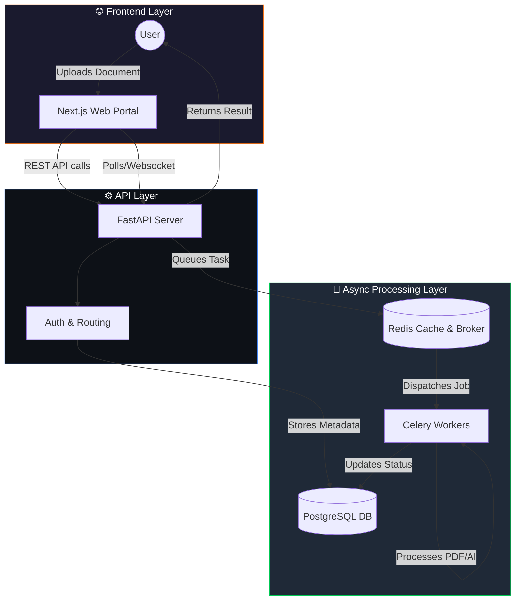

<div align="center">

# 📄 PDFFlow

### Advanced Document Processing & AI Toolkit

[](https://nextjs.org/)
[](https://fastapi.tiangolo.com/)
[](https://tailwindcss.com/)
[](https://www.postgresql.org/)
[](https://www.docker.com/)

<br/>

**A high-performance, fully-featured PDF manipulation and AI processing platform. PDFFlow enables users to merge, split, compress, convert, and leverage AI to summarize, translate, and rewrite documents securely.**

<br/>

[Report Issue](https://github.com/santanu949/PDF-/issues) · [Request Feature](https://github.com/santanu949/PDF-/issues)

</div>

---

## 📖 Overview

### The Problem

Handling PDF files often requires multiple fragmented tools—one for merging, another for compression, and yet another for conversion or OCR. Privacy is a major concern when using free online tools, and integrating AI for document summarization or translation usually involves entirely different platforms.

### The Solution

**PDFFlow** provides a **single source of truth** for document processing. It combines a robust Python FastAPI backend with Celery for heavy asynchronous tasks, paired with a modern Next.js React frontend. Every operation is handled securely, offering everything from standard PDF manipulation to advanced AI-powered text analysis.

The system operates on two planes:
- **Client Frontend** — Zero-friction instant interface for uploading and processing documents.
- **Processing Engine** — Secure, asynchronous backend workers powered by Celery and Redis to handle heavy OCR, conversion, and AI tasks at scale.

---

## ✨ Key Features

### 🛠️ Core PDF Utilities

| Feature | Description |
| :--- | :--- |
| **Merge & Split** | Combine multiple PDFs into one or extract specific pages instantly |
| **Format Conversion** | Convert between PDF and Word, Excel, JPG, PPT seamlessly |
| **Compression** | Reduce file sizes without losing significant visual quality |
| **Security & Protection** | Add watermarks, unlock protected files, or encrypt sensitive documents |
| **Organization** | Rotate, reorder pages, and add page numbers |

### 🧠 AI & Advanced Processing

| Feature | Description |
| :--- | :--- |
| **OCR Text Extraction** | Extract selectable text from scanned images and documents |
| **AI Summarize** | Generate concise summaries of lengthy PDF documents |
| **AI Translate & Rewrite** | Instantly translate document contents or rewrite them for clarity |
| **Smart Signatures & QR** | Append digital signatures and generate QR codes directly onto PDFs |

---

## 🏗️ System Architecture



### Data Flow

1. **Upload & Request** → User uploads a file via the Next.js frontend and selects an operation (e.g., Compress, OCR, AI Summarize).
2. **Task Queuing** → FastAPI validates the request, saves metadata to PostgreSQL, and pushes the heavy processing job to Redis.
3. **Asynchronous Execution** → Celery workers pick up the task, perform the conversion or AI operation, and save the result securely.
4. **Delivery** → The frontend retrieves the completed file for the user to download.

---

## 🛠️ Tech Stack

| Layer | Technology | Purpose |
| :--- | :--- | :--- |
| **Frontend Framework** | [Next.js 16](https://nextjs.org/) & [React 19](https://react.dev/) | Component-based UI with hooks-driven state |
| **Styling** | [Tailwind CSS 4](https://tailwindcss.com/) | Utility-first CSS for responsive, modern design |
| **API Backend** | [FastAPI](https://fastapi.tiangolo.com/) | High-performance Python REST API |
| **Task Queue** | [Celery](https://docs.celeryq.dev/) & [Redis](https://redis.io/) | Asynchronous background job processing |
| **Database** | [PostgreSQL 15](https://www.postgresql.org/) | Relational database for users and job metadata |
| **Containerization** | [Docker](https://www.docker.com/) | Unified environment setup with Docker Compose |

---

## ⚙️ Setup & Installation

### Prerequisites

- **[Docker](https://www.docker.com/)** and **Docker Compose**
- **[Node.js](https://nodejs.org/)** v18+ (if running frontend locally outside Docker)
- **[Python](https://www.python.org/)** 3.10+ (if running backend locally outside Docker)

### 1. Clone the Repository

```bash
git clone https://github.com/santanu949/PDF-.git
cd PDF-
```

### 2. Environment Configuration

Ensure you create the necessary `.env` files for both the backend and frontend.
- Backend: `PdfKit_backend-main/PdfKit_backend-main/backend/.env`
- Frontend: `pdf_project-archita/.env.local`

### 3. Start with Docker Compose (Recommended)

To spin up the entire stack (Postgres, Redis, FastAPI Backend, Celery Worker, and Next.js Frontend) simply run:

```bash
docker-compose up --build
```

### 4. Access the Platform

- **Frontend:** `http://localhost:3000`
- **Backend API Docs:** `http://localhost:8000/docs`

---

## 📁 Project Structure

```
PDF-/
├── docker-compose.yml               # Complete stack orchestrator
├── PdfKit_backend-main/             # Backend Workspace
│   └── PdfKit_backend-main/
│       ├── backend/
│       │   ├── app/                 # FastAPI application logic
│       │   │   ├── api/v1/          # Route handlers (ocr, merge, ai_summarise, etc.)
│       │   │   ├── core/            # Security, Celery app config, settings
│       │   │   ├── workers/         # Celery tasks for heavy lifting
│       │   │   └── main.py          # FastAPI entry point
│       ├── Dockerfile               # Backend container definition
│       └── requirements.txt         # Python dependencies
├── pdf_project-archita/             # Frontend Workspace
│   ├── app/                         # Next.js App Router pages
│   ├── components/                  # React UI components
│   ├── package.json                 # Node dependencies
│   └── Dockerfile                   # Frontend container definition
└── PDFFlow_Engineering_Handbook.docx # System documentation
```

---

## 📈 Current Status

| Module | Status | Version |
| :--- | :--- | :--- |
| Core PDF Operations | 🟢 Production | v1.0 |
| AI Integration (Summarize/Rewrite) | 🟢 Production | v1.0 |
| OCR Capabilities | 🟢 Production | v1.0 |
| Asynchronous Processing Pipeline | 🟢 Production | v1.0 |
| Next.js Web Interface | 🟢 Production | v1.0 |

---

## 👥 Contributors

<table>
  <tr>
    <td align="center">
      <a href="https://github.com/santanu949">
        <br />
        <sub><b>Santanu</b></sub>
      </a><br />
      <sub>Creator & Lead Developer</sub>
    </td>
  </tr>
</table>

---

<div align="center">
  <br/>
  
  <br/><br/>
  <sub>© 2026 PDFFlow — All Rights Reserved.</sub>
</div>